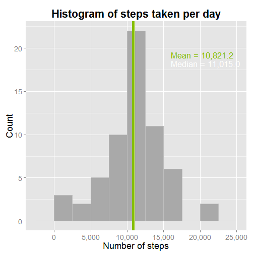

# Reproducible Research: Peer Assessment 1


## Loading and preprocessing the data
First, set the working directory to the one containing the locally forked/cloned content from Github (http://github.com/rdpeng/RepData_PeerAssessment1):

```r
setwd("C:/Users/dlabar/Google Drive/Coursera/Data Science/RepData_PeerAssessment1")
```

The file `activity.zip` should already exist in this directory.  Unzip it and load it into a `data.table`:

```r
unzip("activity.zip")

library(data.table)
activity <- fread("activity.csv")
```

Check the structure of the `activity` table:

```r
str(activity)
```

```
## Classes 'data.table' and 'data.frame':	17568 obs. of  3 variables:
##  $ steps   : int  NA NA NA NA NA NA NA NA NA NA ...
##  $ date    : chr  "2012-10-01" "2012-10-01" "2012-10-01" "2012-10-01" ...
##  $ interval: int  0 5 10 15 20 25 30 35 40 45 ...
##  - attr(*, ".internal.selfref")=<externalptr>
```

The `date` column needs to be converted from character format to date:

```r
activity[,date:=as.Date(date)]
```

```
##        steps       date interval
##     1:    NA 2012-10-01        0
##     2:    NA 2012-10-01        5
##     3:    NA 2012-10-01       10
##     4:    NA 2012-10-01       15
##     5:    NA 2012-10-01       20
##    ---                          
## 17564:    NA 2012-11-30     2335
## 17565:    NA 2012-11-30     2340
## 17566:    NA 2012-11-30     2345
## 17567:    NA 2012-11-30     2350
## 17568:    NA 2012-11-30     2355
```

Finally, load some packages that will be used in the coming sections:

```r
library(ggplot2)
library(scales)
library(gridExtra)
library(chron)
```

Now we can start exploring the data and answering some questions...

## What is mean total number of steps taken per day?
First, use `data.table` to create a summary that:
- Ignores records where the count of steps are `NA`
- Sums the number of steps by calendar date
- Calculates the overall daily mean and median number of steps


```r
activitySummary <- t(activity[!is.na(steps), list(steps=sum(steps)), by=date
                              ][,list(Mean=mean(steps),Median=median(steps))])

activitySummary
```

```
##         [,1]
## Mean   10766
## Median 10765
```

Now, use `ggplot2` to create a histogram of average steps taken per day.  Overlay the mean value in green, and the median value in white.


```r
ggplot(activity[!is.na(steps),list(steps=sum(steps)),by=date], aes(x=steps)) +
  geom_histogram(color="grey", fill="darkgrey", binwidth=2500L) +
  geom_vline(xintercept=as.vector(activitySummary),
             color=c("#84BD00","white"), size=c(2,0.5)) +
  annotate("text", x=16000, y=c(16.75,15.9), hjust=0, size=6,
           label=paste0(row.names(activitySummary), " = ", formatC(activitySummary, big.mark=",", format="f", digits=1)),
           color=c("#84BD00","white")) +
  scale_x_continuous(minor_breaks=NULL, labels=comma) +
  labs(title=expression(bold("Histogram of steps taken per day")),
       x="Number of steps",
       y="Count") +
  theme_gray(base_size=18)
```

 

As can be seen in the plot, the steps are fairly centrally located around the mean of 10,766.2.

## What is the average daily activity pattern?
Create a `data.table` containing the mean number of steps (ignoring `NA` values) for each 5-minute interval:

```r
activityIntervals <- activity[!is.na(steps),list(steps=mean(steps)),by=interval]

activityIntervals
```

```
##      interval   steps
##   1:        0 1.71698
##   2:        5 0.33962
##   3:       10 0.13208
##   4:       15 0.15094
##   5:       20 0.07547
##  ---                 
## 284:     2335 4.69811
## 285:     2340 3.30189
## 286:     2345 0.64151
## 287:     2350 0.22642
## 288:     2355 1.07547
```

Sort the above result in descending order by the steps column.  Select the first row, which has the value with the greatest number of average steps:

```r
activitySummaryIntervals <- activityIntervals[order(-steps)][1]

activitySummaryIntervals
```

```
##    interval steps
## 1:      835 206.2
```

Now, use `ggplot2` to create a time series showing the average steps by 5-minute time interval:

```r
ggplot(data=activity[!is.na(steps),list(steps=mean(steps)),by=interval], aes(x=interval,y=steps)) + geom_line(size=1) +
  geom_point(data=activitySummaryIntervals, size=4, color="#84BD00") +
  annotate("text", x=1050, y=188, hjust=0, size=6,
           label=paste0("Interval ",activitySummaryIntervals[,interval], " has the maximum\naverage number of steps (",formatC(activitySummaryIntervals[,steps], big.mark=",", format="f", digits=0),")"),
           color="#84BD00") +
  labs(title=expression(bold("Average steps taken within 5-minute intervals")),
       x="Interval",
       y="Number of steps (averaged across all days)") +
  theme_gray(base_size=18)
```

 

As can be seen from the plot, there are very few steps taken until Interval 500.  Then, until Interval 1900 or so, the range of steps is between roughly 25 and 100.  However there is a peak at **Interval 835**, which has the maximum average number of steps (**206**).  Finally, the number of steps after Interval 1900 tapers back down to 0.

## Imputing missing values
To test the effect of missing values, replace `NA` values of the step count with the mean value for that interval on that day of the week.  For example, if Interval 2355 is missing on 2012-11-30, use the mean value (1.143) for all Tuesdays during Interval 2355.

Start by adding a column called `dayOfWeek` to the `activity` table:

```r
activity[,dayOfWeek:=weekdays(date)]
```

```
##        steps       date interval dayOfWeek
##     1:    NA 2012-10-01        0    Monday
##     2:    NA 2012-10-01        5    Monday
##     3:    NA 2012-10-01       10    Monday
##     4:    NA 2012-10-01       15    Monday
##     5:    NA 2012-10-01       20    Monday
##    ---                                    
## 17564:    NA 2012-11-30     2335    Friday
## 17565:    NA 2012-11-30     2340    Friday
## 17566:    NA 2012-11-30     2345    Friday
## 17567:    NA 2012-11-30     2350    Friday
## 17568:    NA 2012-11-30     2355    Friday
```

Next, average the count of steps by day of week and the interval, and add the result in a column called `steps2`:

```r
activity[,steps2:=mean(as.numeric(steps),na.rm=T),by=list(dayOfWeek,interval)]
```

```
##        steps       date interval dayOfWeek steps2
##     1:    NA 2012-10-01        0    Monday  1.429
##     2:    NA 2012-10-01        5    Monday  0.000
##     3:    NA 2012-10-01       10    Monday  0.000
##     4:    NA 2012-10-01       15    Monday  0.000
##     5:    NA 2012-10-01       20    Monday  0.000
##    ---                                           
## 17564:    NA 2012-11-30     2335    Friday  0.000
## 17565:    NA 2012-11-30     2340    Friday  0.000
## 17566:    NA 2012-11-30     2345    Friday  0.000
## 17567:    NA 2012-11-30     2350    Friday  0.000
## 17568:    NA 2012-11-30     2355    Friday  1.143
```

However, this sets all rows in `steps2` to the mean value for that combination of day and interval.  So overwrite the `steps2` value with the original value from the `steps` column, if the `steps` column is not `NA`:

```r
activity[!is.na(steps),steps2:=steps]
```

Similar to before, create a summary that sums the number of steps by calendar date, and calculates the overall daily mean and median number of steps:


```r
activitySummary2 <- t(activity[,list(steps=sum(steps2)),by=date][,list(Mean=mean(steps),Median=median(steps))])

activitySummary2
```

```
##         [,1]
## Mean   10821
## Median 11015
```

Note that this time the `NA` values were not removed, since they have been filled in with the mean.  As before, create a histogram with `ggplot2` that shows the average steps taken per day:


```r
ggplot(activity[,list(steps=sum(steps2)),by=date], aes(x=steps)) +
  geom_histogram(color="grey", fill="darkgrey", binwidth=2500L) +
  geom_vline(xintercept=as.vector(activitySummary2),
             color=c("#84BD00","white"), size=c(2,0.5)) +
  annotate("text", x=16000, y=c(19.25,18.25), hjust=0, size=6,
           label=paste0(row.names(activitySummary2), " = ", formatC(activitySummary2, big.mark=",", format="f", digits=1)),
           color=c("#84BD00","white")) +
  scale_x_continuous(minor_breaks=NULL, labels=comma) +
  labs(title=expression(bold("Histogram of steps taken per day")),
       x="Number of steps",
       y="Count") +
  theme_gray(base_size=18)
```

 

Filling in the missing values has shifted both the mean (from 10,766.2 to 10,821.2) and the median (from 10,765.0 to 11,015.0) to the right as expected.

## Are there differences in activity patterns between weekdays and weekends?
Use the `is.weekend` function from the `chron` package to add a column indicating whether the date for each row is a weekday or on the weekend:

```r
activity[,dayType:=ifelse(is.weekend(date),"Weekend","Weekday")][]
```

```
##        steps       date interval dayOfWeek steps2 dayType
##     1:    NA 2012-10-01        0    Monday  1.429 Weekday
##     2:    NA 2012-10-01        5    Monday  0.000 Weekday
##     3:    NA 2012-10-01       10    Monday  0.000 Weekday
##     4:    NA 2012-10-01       15    Monday  0.000 Weekday
##     5:    NA 2012-10-01       20    Monday  0.000 Weekday
##    ---                                                   
## 17564:    NA 2012-11-30     2335    Friday  0.000 Weekday
## 17565:    NA 2012-11-30     2340    Friday  0.000 Weekday
## 17566:    NA 2012-11-30     2345    Friday  0.000 Weekday
## 17567:    NA 2012-11-30     2350    Friday  0.000 Weekday
## 17568:    NA 2012-11-30     2355    Friday  1.143 Weekday
```

Use the `facet_grid` option of `ggplot2` to show the time series of steps for weekdays and weekends:

```r
ggplot(data=activity[,list(steps=mean(steps2)),by=list(dayType,interval)], aes(x=interval,y=steps,color=dayType)) + geom_line(size=1) +
  facet_grid(dayType ~ .) +
  labs(title=expression(bold("Average steps taken within 5-minute intervals")),
       x="Interval",
       y="Number of steps (averaged across all days)") +
  guides(color=F) +
  theme_gray(base_size=18)
```

 

The weekday series in the top grid indicates a higher level of activity in the earlier intervals (perhaps getting up for work?), followed by a brief period of high activity (walking to the office?), and a long period of relatively low activity (sitting at a desk?).  The weekend series in the bottom grid is generally shifted to the right (sleeping in and staying up late?), and indicates a relatively high, sustained activity during the middle of the day (shopping, or some similar type of activity?).
